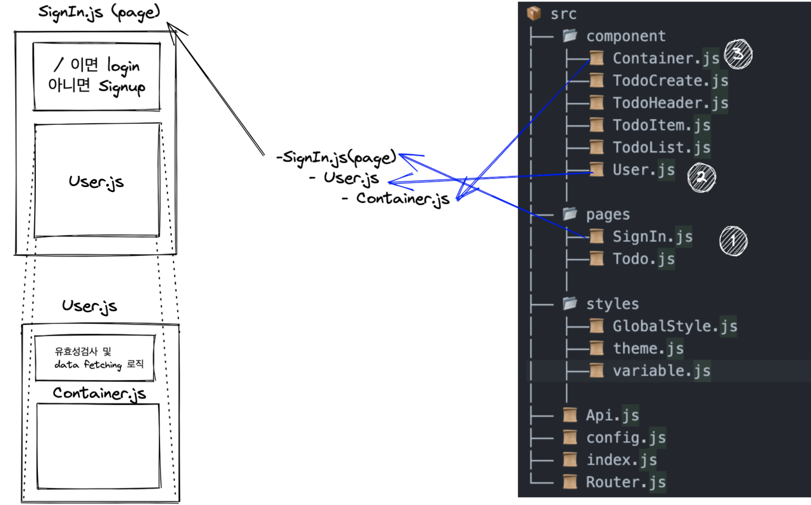
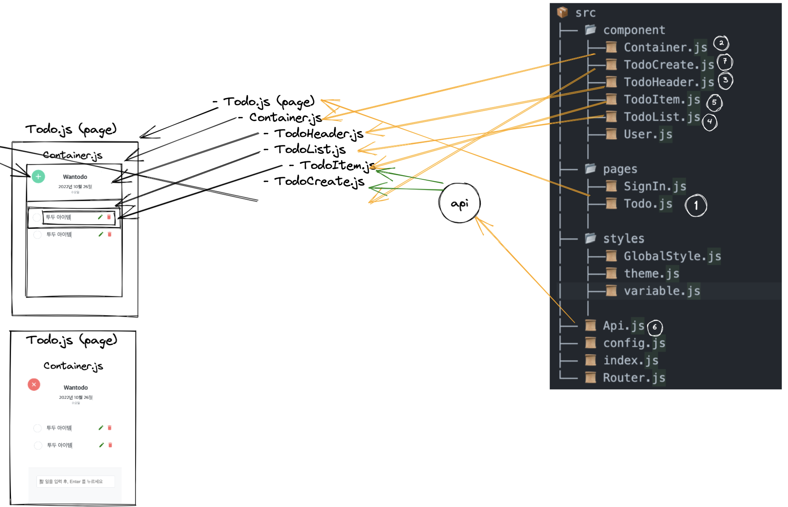

# 원티드 프리온보딩 프론트엔드 코스

#### 이 레파지토리는 원티드 프리온보딩 프론트엔드 과정 선발 과제 제출용 저장소입니다.

- #### 배포 링크 : [👉베포 링크👈](https://codyman0.github.io/wanted-pre-onboarding-frontend/)
- #### 숏에세이 : [👉숏에세이 링크👈](https://blog.naver.com/hys8375/222902309033)

### STACK

     

---

## 목차

- [프로젝트의 실행](#프로젝트의실행)
- [폴더 구조](#폴더구조)
- [구현 사항](#구현사항)

---

</br>

## 프로젝트의실행

```
$ npm install
$ npm start
```

## 폴더구조

```
📦 src
├── 📂 component
│   ├──📜 Container.js
│   ├──📜 TodoCreate.js
│   ├──📜 TodoHeader.js
│   ├──📜 TodoItem.js
│   ├──📜 TodoList.js
│   ├──📜 User.js
│   │
├── 📂 pages
│   ├──📜 SignIn.js
│   ├──📜 Todo.js
│   │
├── 📂 styles
│   ├──📜 GlobalStyle.js
│   ├──📜 theme.js
│   ├──📜 variable.js
│   │
├── 📜 Api.js
├── 📜 config.js
├── 📜 index.js
└── 📜 Router.js
```

## 구현사항

### \* 로그인 / 회원가입 기능 구현

#### 1. 컴포넌트 구조



- **SignIn 페이지**
  useLocation을 활용해서 url의 Path를 알 수 있다. 만약 path가 "/" 라면 Login 데이터를 아니라면 SignUp 데이터를 User 컴포넌트에게 보내고 있다.

  ```jsx
  const location = useLocation();
  const currentURL = location.pathname;
  const isSelectLogin = currentURL === '/' && true;

  const LOGIN_DATA = {
    title: 'Login',
    text: '계정이 없으신가요?',
    url: '/signup',
  };
  const SIGNUP_DATA = {
    title: 'SignUp',
    text: '이미 가입하셨나요?',
    url: '/',
  };

  <User data={isSelectLogin ? LOGIN_DATA : SIGNUP_DATA} />;
  ```

- **User 컴포넌트**
  받은 Data에 따라 인풋의 갯수와 다른 유효성 검사를 진행하는 로직을 가지고 있다. 또한 토큰이 있을 경우에는 /Todo로 넘어가도록 useEffect Hook을 활용하고 있다.

</br>

#### 2. 기능 명세

- **자동 로그인 기능**

```javascript
//User.js
useEffect(() => {
  if (localStorage.getItem('token')) {
    alert('자동 로그인 되었습니다.');
    navigate('/todo');
  }
}, [navigate]);
```

로컬 스토리지에 토큰이 있으며 `todo`페이지로 자동 로그인이 됩니다.
</br>

- **버튼 활성화 기능**

변수에 유효성 검사 조건을 선언한 후, 객체를 만들어 받은 데이터가 Login일 경우와 SignUp일 경우를 분기하여 설정했습니다.받은 데이터 안에는 title이 있으며 아래의 코드를 보시면 disabled 안에서 유효성 검사에 사용되고 있습니다.

```javascript
//User.js
const emailValidation = authInputs.email.includes('@');
const passwordValidation = authInputs.password.length >= 8;
const passwordReValidation = authInputs.password === authInputs.passwordConfirm;

const isValidInputs = {
  Login: emailValidation && passwordValidation,
  SignUp: emailValidation && passwordValidation && passwordReValidation,
};

return (
  <Button type="submit" disabled={!isValidInputs[title]}>
    {title}
  </Button>
);
```

</br>
</br>

- **로그인과 회원가입 페이지에서 아이디, 비밀번호 확인 및 토큰 발급**

```javascript
//User.js
const onSubmitAuth = e => {
  e.preventDefault();
  const { email, password } = authInputs;
  const authUrl =
    title === 'Login' ? `${baseUrl}/auth/signin` : `${baseUrl}/auth/signup`;
  const options = {
    method: 'POST',
    headers: { 'Content-Type': 'application/json' },
    body: JSON.stringify({ email, password }),
  };

  fetch(authUrl, options)
    .then(res => res.json())
    .then(data => {
      if (data.access_token) {
        token = data.access_token;
        localStorage.setItem('token', token);
        navigate('/todo');
      } else {
        const authTitle =
          title === 'Login'
            ? '로그인 정보를 확인해주세요.'
            : '회원 정보를 확인해주세요';
        alert(authTitle);
        navigate('/signup');
      }
    });
};
```

### \* 투두 리스트

#### 1. 컴포넌트 구조도



```jsx
//API.js
//데이터 fetching 관련 컴포넌트 (CRUD)

function token() {
  return localStorage.getItem('token');
}
export const API = {
  //get API
  Get: setTodoList => {
    const uri = `${baseUrl}/todos`;
    const options = {
      method: 'GET',
      headers: { Authorization: `Bearer ${token()}` },
    };

    fetch(uri, options)
      .then(res => res.json())
      .then(data => setTodoList([...data]));
  },

  //Post API
  Post: (bodyData, setTodoList) => {
    const uri = `${baseUrl}/todos`;
    const options = {
      method: 'POST',
      headers: {
        Authorization: `Bearer ${token()}`,
        'Content-Type': 'application/json',
      },
      body: JSON.stringify(bodyData),
    };

    fetch(uri, options)
      .then(res => res.json())
      .then(data => setTodoList(prev => [...prev, data]));
  },

  //Update API
  Update: (id, todo, isCompleted) => {
    const updateUri = `${baseUrl}/todos/${id}`;
    const options = {
      method: 'PUT',
      headers: {
        Authorization: `Bearer ${token()}`,
        'Content-Type': 'application/json',
      },
      body: JSON.stringify({ todo: todo, isCompleted: isCompleted }),
    };
    fetch(updateUri, options).then(({ ok }) => {
      if (ok) {
        alert('수정되었습니다.');
      }
    });
  },

  //Delete API
  Delete: async id => {
    const deleteUri = `${baseUrl}/todos/${id}`;
    const options = {
      method: 'DELETE',
      headers: {
        Authorization: `Bearer ${token()}`,
        'Content-Type': 'application/json',
      },
    };
    fetch(deleteUri, options).then(({ ok }) => {
      if (ok) {
        alert('삭제되었습니다');
      }
    });
  },
};
```

API.js 컴포넌트에서 설정한 데이터 fetching 로직을 TodoItem과 TodoCreate에서 import해서 사용하고 있다.

```jsx
//TodoItem.js
import { API } from '../Api';

const deleteList = selectedId => {
  if (window.confirm('삭제하시겠습니까?')) {
    setTodoList(prev => prev.filter(({ id }) => id !== selectedId));
    API.Delete(selectedId);
  }
};
```

```jsx
//TodoCreate.js
import { API } from '../Api';

const addList = e => {
  e.preventDefault();
  API.Post({ todo: todoInput }, setTodoList);
  setTodoInput('');
  setOpen(false);
};
```
